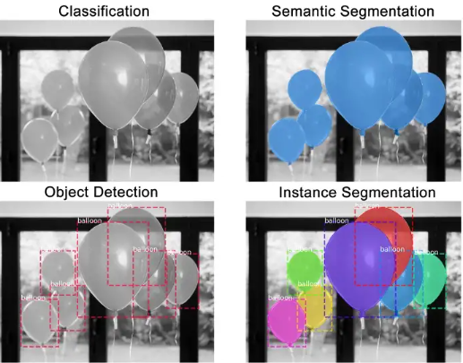
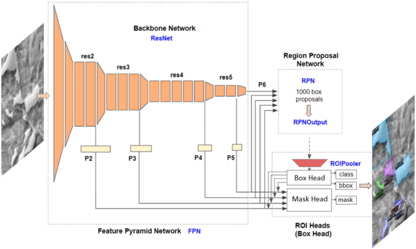

# 69번 지능형 곤충 스마트팜(누에, 쌍별귀뚜라미) 데이터 모델편

---
## 모델
### 1. AI 곤충 영상 분석모델
- 모델 명: Detectron2
- 모델 버전: 0.6v

##### 모델 Task

 + 객체탐지(Instance segmentation)\
       \
   + 출처: Splash of Color: Instance Segmentation with Mask R-CNN and TensorFlow -
Waleed Abdulla
##### Backbon
 + Resnet-50\
\
  - 출처: Automated segmentation of martensite-austenite islands in bainitic steel - Deniz İren
#### Parameters
| 모델 파라미터 | 값     | 비고         |
|---------|-------|------------|
| COCO-InstanceSegmentation/mask_rcnn_R_101_FPN_3x  | -     | 학습 구조 및 모델 |
| DATALOADER.NUM_WORKERS    | 2     | 사용할 코어 수   |
| SOLVER.IMS_PER_BATCH    | 2     | 배치 사이즈     |
| SOLVER.BASE_LR    | 0.001 | 학습률        |
| SOLVER.MAX_ITER   | 8000  | 학습량        |
| MODEL.ROI_HEADS.BATCH_SIZE_PER_IMAGE    | 128   | 미니배치 사이즈   |
| MODEL.ROI_HEADS.NUM_CLASSES   | 4     | 클래스 개수     |

#### Input
    - polygon 좌표 : [(x1,y1),(x2,y2),(x3,y3)....]

#### Output
    - 해당 이미지안의 각 객체 Class

### 2. AI 곤충 생육 환경 분석모델
- 모델 명: Randomforest
- 모델 버전: 4.7

##### 모델 Task

 + 회귀분석

---

